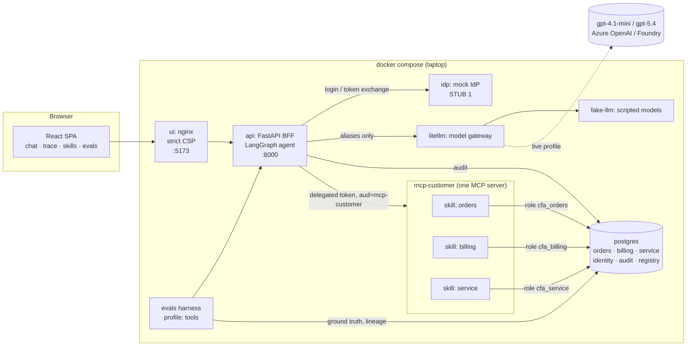
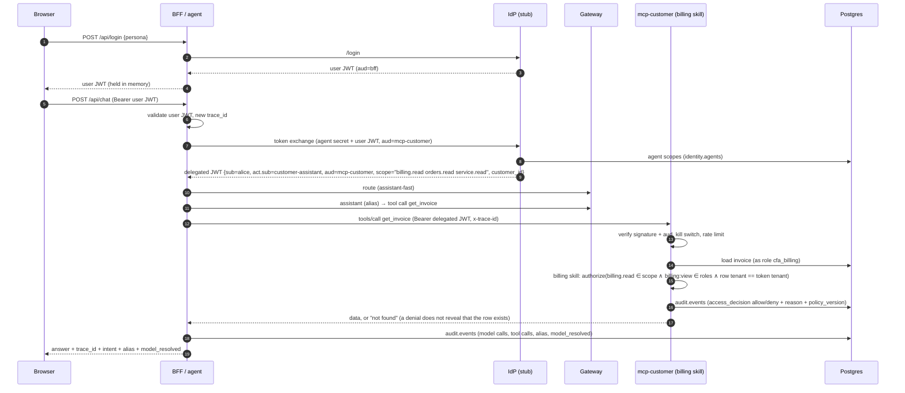

# Architecture

## Components



## One MCP server, three skills

The customer-data bounded context is served by **one** MCP server, `mcp-customer` (`src/cfa/skills/server.py`). It is one process, one token audience and one endpoint. It hosts three **skills**, each a module with its own `manifest.yaml`, `repository.py`, `models.py` and `skill.py`:

| Skill | Tools | Risk tier | Agent scope | User role | DB role | Audit `component` |
|---|---|---|---|---|---|---|
| orders | `list_orders`, `get_order` | 1 | `orders.read` | `orders:view` | `cfa_orders` | `mcp-customer/orders` |
| billing | `list_invoices`, `get_invoice` | **2** | `billing.read` | `billing:view` | `cfa_billing` | `mcp-customer/billing` |
| service | `get_service_history`, `search_troubleshooting` | 1 | `service.read` | `service:view` | `cfa_service` | `mcp-customer/service` |

The server is the deployment unit. The skill remains the unit of entitlement, least privilege, audit, risk tier and promotion:
- **Entitlement:** each skill has its own `Boundary` that checks its own agent scope and user role, plus the row tenant.
- **Least privilege:** each skill has its own connection pool that logs in as its own Postgres role. A bug in billing code cannot read another skill's schema.
- **Audit:** every decision is recorded as `mcp-customer/<skill>`.
- **Risk tier:** it is read from each skill's manifest, so billing stays tier 2 even though it shares a process with tier-1 skills.
- **Kill switch:** `DISABLED_SKILLS=billing` (via `make disable-skill SKILL=billing`) switches one skill off while the rest keep serving. Calls are denied and audited with reason `skill_disabled`.

Other properties of the server:
- **Invariant:** `create_server` refuses to start if a skill registers tools other than those its manifest declares.
- **Discovery:** every tool carries `_meta.skill` and a title such as `[billing] get_invoice`.
- **Catalogue:** the resource `skills://catalog` returns the skills, their tools and entitlements, and the **caller's** current access to each one. It uses the same `authorize()` function as the tools. The BFF exposes this as `/api/skills`, which feeds the UI **Skills** tab, and `make skills PERSONA=bob` prints it in the terminal.
- **Pinned tools:** the agent's tools are still pinned client-side (`tools.py`). The catalogue is for people, not for the model.

For why this is one server and not three, and when to split it again, see [ADR-004](adr/004-one-mcp-server-many-skills.md).

Only `ui` (5173) and `api` (8000) are published, and only on 127.0.0.1. Everything else lives on the compose network. All containers run read-only, non-root, with `cap_drop: ALL`.

## The agent graph

```
START → route → assistant (create_agent subgraph with middleware) → END
```

- **`route`** makes a structured-output call on `assistant-fast` and gets back `Intent ∈ {orders, billing, service, troubleshooting, other}`. It then calls `choose_alias(intent)`, a static versioned table (`src/cfa/agent/routing.py`): troubleshooting → `assistant-reasoning`, everything else → `assistant-fast`.
- **`assistant`** is `create_agent` with six pinned tools and three middlewares:
  - model-by-alias: a `wrap_model_call` that selects the model from `state["model_alias"]`
  - an audit middleware that records every model call and tool call
  - `model_metadata`, which reads `x-litellm-model-name` and fallback headers so the audit knows which deployment actually answered
- **Identity** travels in the LangGraph **runtime context** (`context_schema=RequestContext`), never in state or in the prompt. The model cannot see or alter it.

## Identity flow



Key properties:
- **No token passthrough.** The user token never reaches a skill. The skill server only accepts tokens minted for `aud=mcp-customer`. Those tokens are **down-scoped**: `scope` contains only the skill scopes the agent currently holds, so revoking `billing.read` takes effect on the next request.
- **`customer_id` is never a tool argument.** It comes from the token, so the model cannot change it.
- **Enforcement sits at the data boundary**, after the row is loaded. If the model is talked into requesting INV-5202, which belongs to another tenant, the skill still denies it.

## Audit and lineage (`audit.events`)

| Column | Meaning |
|---|---|
| `trace_id` | One user turn, end to end (BFF → agent → skills) |
| `component`, `action`, `name` | e.g. `agent / model_call / assistant-reasoning`, `mcp-customer/billing / access_decision / get_invoice` |
| `actor_user`, `actor_agent` | `alice`, `customer-assistant` |
| `decision`, `reason` | `allow` / `deny`, plus a reason (`user_role_missing`, `agent_scope_missing`, `cross_tenant`, `skill_disabled`) |
| `model_alias`, `model_resolved`, `provider` | What was requested vs which deployment answered (incl. `(failover)`) |
| `input`, `output` | What the agent saw and what came back (JSONB, size-capped) |
| policy/routing versions, latency, tokens | Also stored per event |

Service roles have `INSERT` only on `audit.events`. Only the platform role (BFF) and the eval role can read it. The UI's Trace tab is this table, filtered to the caller's own traces.

## Promotion registry (`registry.assets`)

Each `make eval` inserts a decision record: `certified` / `blocked` / `harness_invalid`, the gate results, and the **bindings** (graph version, prompt hash, routing policy version, gateway config hash, skill manifests hash, dataset hash). The BFF recomputes the current bindings on every request. Any difference marks the certificate **stale**; for example, `make swap-provider` changes `gateway_config_hash`.

## Code map

| Path | What |
|---|---|
| `src/cfa/agent/` | graph, routing, middleware, pinned tools, skills client, prompts |
| `src/cfa/api/app.py` | BFF endpoints |
| `src/cfa/identity/` | mock IdP (stub), token validation, token-exchange client |
| `src/cfa/policy.py` | entitlement decision (stub 2) |
| `src/cfa/skills/{orders,billing,service}/` | one MCP server per data product: `server.py`, `repository.py`, `models.py`, `manifest.yaml` |
| `src/cfa/skills/runtime.py` | shared skill runtime: token verifier, `Boundary` (authorize + audit + rate limit + error hygiene), DNS-rebinding protection |
| `src/cfa/fake_llm/` | deterministic OpenAI-compatible model used offline and in evals |
| `gateway/profiles/` | gateway configs: `fake`, `live`, `*-swapped`, `*-broken` |
| `evals/` | cases, canaries, graders, gates, mutants, promotion policy, harness |
| `db/init/` | schema, seed data, least-privilege roles |
| `ui/` | React SPA + nginx |
