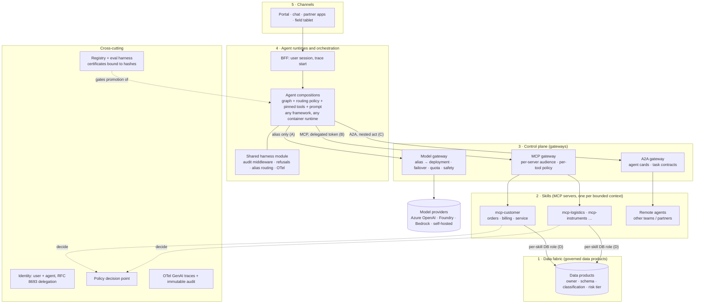

# Target architecture: the agent plane

This is the one-page target state. It covers runtimes, orchestration, the model gateway, and the MCP and A2A spine across the layers of the fabric. It also shows where the vendor-neutral boundaries sit and what would break them. The PoC is a working slice of it ([architecture.md](architecture.md)). Azure and AWS equivalents are in [production-mapping.md](production-mapping.md).

## The layers

| Layer | What lives here | Owns the decision about | PoC today |
|---|---|---|---|
| 5 Channels | UIs and integrations | Presentation only | React SPA behind nginx |
| 4 Runtimes and orchestration | BFF, agent compositions, shared harness module | *Which class of model* a request deserves, which skills to call, how to compose them | FastAPI + LangGraph, `route → assistant`, `choose_alias()` |
| 3 Control plane | Model, MCP and A2A gateways | *Which deployment* serves an alias; who may reach which server or agent | LiteLLM; no MCP or A2A gateway yet (direct hop) |
| 2 Skills | One MCP server per bounded context; skills are the unit of governance ([ADR-004](adr/004-one-mcp-server-many-skills.md)) | Entitlement at the data boundary, least privilege, the skill contract | `mcp-customer` with three skills |
| 1 Data fabric | Governed data products | Schema, classification, risk tier, ownership | Postgres schemas, one role per skill |
| Cross-cutting | Identity, PDP, audit/OTel, registry + harness | Who acted, what was allowed, what was certified | Stub IdP, stub `policy.py`, `audit.events`, `registry.assets` |

**The intelligence stays in the fabric.** Skills are deterministic and never call a model. Business meaning comes from the data products and their manifests. The agent reasons over what the skills return and does not reimplement it in prompts.

**MCP versus A2A.** MCP is the spine for tools and data: request/response, one owner per server. A2A is only for delegating to an *agent* that another team owns, that runs for a long time, or that is reached from outside the platform. Until one of those applies, A2A is not used ([ADR-002](adr/002-a2a-not-yet.md)). Both go through the same control plane, so neither becomes a side door.

## Where the vendor-neutral boundaries actually sit

Neutrality is not a property of the whole stack. It is enforced at four seams. Everything between two seams may be vendor-specific, as long as nothing leaks across a seam.

| # | Seam | The neutral contract | What is allowed to be vendor-specific behind it | What would violate it | How the violation is caught |
|---|---|---|---|---|---|
| A | Agent → model gateway | An **alias** (`assistant-fast`, `assistant-reasoning`) over an OpenAI-compatible chat contract, plus the gateway's normalised errors | Provider, deployment, region, keys, failover, content safety, a managed router *behind* an alias | A model name, endpoint or key in agent code or config · branching on a vendor's error code · a vendor SDK in the agent · a managed auto-router used *as* the seam · vendor-only features (e.g. assistants/threads APIs, provider-side tool execution) | `gateway_config_hash` and `agent_code_hash` are separate bindings; `make swap-provider` must leave agent hashes unchanged; `make compare-providers` / `make eval-matrix` show whether behaviour survived |
| B | Agent → skills | **MCP** tool calls with a pinned client-side schema, carrying a delegated, audience-bound token | Server framework, language, hosting, database engine | Token passthrough (user token reaching a skill) · tenant id as a tool argument · a skill that calls a model · a tool signature shaped for one model's quirks · a proprietary tool protocol in place of MCP | Server audience check; `create_server` refuses tools not in the manifest; eval cases `deny-cross-tenant-*`, mutant M2 |
| C | Agent → agent | **A2A** agent card and task contract, with the delegation chain as nested `act` claims | The remote agent's framework, prompt and model | Calling another team's agent through its internal API · sharing a framework's in-memory state or checkpoints across teams · passing the user's original token downstream | Remote agent treated as a dependency with its own certificate; our promotion binds to its version |
| D | Skill → data product | The data product's **schema and entitlement contract** `(principal, action, resource) → decision + reason + version` | Storage engine, PDP implementation (OPA, Cedar, Verified Permissions) | Agents or prompts querying data stores directly · entitlement checked only in the agent or UI · policy embedded in a vendor's agent service config | Per-skill DB roles; decision recorded per call with `policy_version` |

Cross-cutting seams follow the same rule:

- **Identity:** OIDC/JWT and RFC 8693 token exchange. Entra Agent ID and AgentCore Identity are implementations, not the contract. A violation is a skill that trusts a vendor-specific header instead of a verified token.
- **Observability:** OTel GenAI spans with the audit `trace_id` equal to the OTel trace id. A violation is lineage that exists only in one vendor's console.
- **Evals and promotion:** the harness is ours and runs in our pipeline. Vendor evaluation services only give advisory scores. A violation is a promotion decision taken inside a vendor tool.

## What is deliberately *not* neutral

- **The agent framework** (LangGraph) is a choice made inside layer 4, not a boundary. Replacing it is a rewrite of one composition, not of the plane, because seams A–D do not depend on it.
- **The chat contract is OpenAI-shaped.** It is the de facto standard that APIM, LiteLLM and most model proxies expose, but it is not a formal standard. Models that do not honour strict `json_schema` output (see `gateway/model-contracts.yaml`) are absorbed at the gateway or recorded as a known difference, never special-cased in the agent.
- **Behaviour is not neutral, even when the wiring is.** The PoC swap was config-only, but 4 of 20 cases regressed and needed a refusal handler and prompt fixes ([ADR-001](adr/001-model-gateway-and-routing.md)). "Mechanical at the gateway" is only true if every swap is also a promotion event that re-runs the gates.

## Gap between the PoC and this target

| Target element | PoC status |
|---|---|
| MCP gateway in front of skill servers | Not present: the agent calls `mcp-customer` directly |
| A2A gateway and remote agents | Not built, by decision ([ADR-002](adr/002-a2a-not-yet.md)) |
| Real IdP with agent workload identity | Stub 1 ([ADR-003](adr/003-deliberate-stubs.md)) |
| Central PDP | Stub 2, in-process `policy.py` |
| Second model *vendor* behind the gateway | Slot exists (`live-alt`), not run; both live providers are Azure OpenAI deployments |
| Immutable audit store | Append-only by grants in Postgres |
